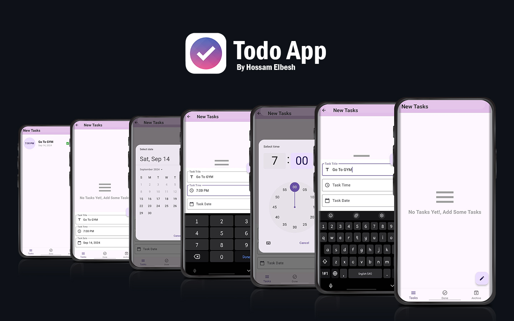

# Todo Application

A simple Flutter Todo App that helps users manage tasks efficiently with a clean and responsive UI.


## Features

- Add, edit, delete, and mark tasks as done or archived.
- Organized task management with task categories (New, Done, Archived).
- Uses local SQLite database for persistent task storage.
- Bloc state management for efficient state handling.

## Technologies Used

- **Flutter**: For building the UI and logic.
- **Bloc**: State management.
- **SQLite**: Local database for task storage.
- **Conditional Builder**: For handling conditional UI rendering.

### Installation

1. Clone the repository:

    ```bash
    git clone https://github.com/HossamElbesh/Todo-App.git
    ```

A few resources to get you started if this is your first Flutter project:

- [Lab: Write your first Flutter app](https://docs.flutter.dev/get-started/codelab)
- [Cookbook: Useful Flutter samples](https://docs.flutter.dev/cookbook)

For help getting started with Flutter development, view the
[online documentation](https://docs.flutter.dev/), which offers tutorials,
samples, guidance on mobile development, and a full API reference.
